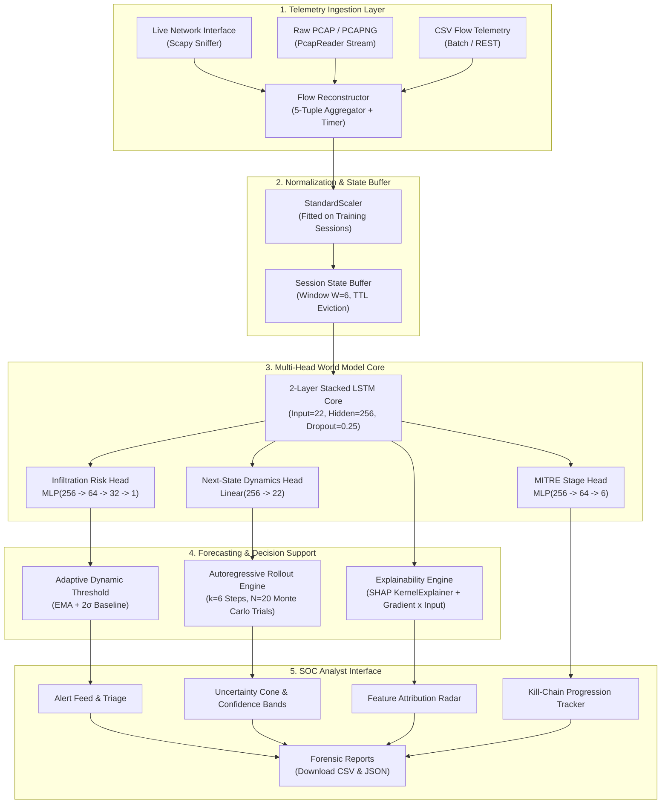
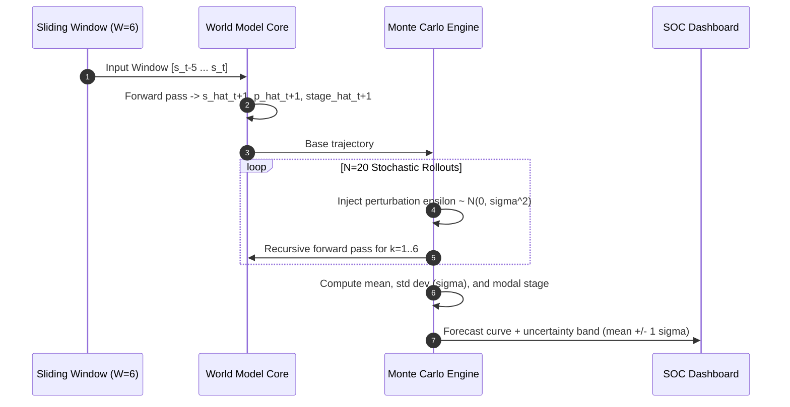
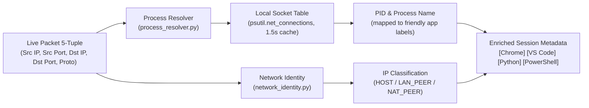

<div align="center">

# Project Garud — System Architecture
### Deep World Model Telemetry Engine for Predictive Cyber Defense
**Smart India Hackathon 2026 — Problem Statement ID 26153 (NTRO) • Team Code 4 Change**

[](ARCHITECTURE.md)
[](ARCHITECTURE.md#3-telemetry-feature-space--22-vector-representation)
[](https://pytorch.org)
[](https://attack.mitre.org)

</div>

---

## 1. Mathematical Foundation: The Network World Model

Traditional intrusion detection operates on static point classifications: given an observed flow $x_t$, predict $y_t \in \{0, 1\}$. This formulation discards historical trajectory, lacks predictive agency, and cannot forecast what an adversary will do next.

**Project Garud** (utilizing the **NetForecast** deep recurrent telemetry engine) adopts the **World Model** formulation from reinforcement learning and sequential decision theory:
$$\mathcal{M} = \langle \mathcal{S}, \mathcal{T}, \Omega, \mathcal{R} \rangle$$

Where:
- $\mathcal{S} \subset \mathbb{R}^{22}$ is the continuous network state space defined by standardized statistical and temporal flow features.
- A sliding history window $W_t = [s_{t-5}, s_{t-4}, \dots, s_t] \in \mathbb{R}^{6 \times 22}$ represents the current behavioral context.
- $\mathcal{T}: \mathcal{S}^W \to \mathcal{S}$ is the learned transition operator predicting the subsequent network state:
  $$\hat{s}_{t+1} = \mathbb{E}[s_{t+1} \mid W_t]$$
- $\Omega: \mathcal{S}^W \to [0, 1]$ is the threat progression operator estimating the probability of malicious activity:
  $$\hat{p}_{\text{inf}} = P(\text{Malicious} \mid W_t)$$
- $\mathcal{R}: \mathcal{S}^W \to \Delta^5$ maps the state trajectory onto the 6-simplex of MITRE ATT&CK stages:
  $$\hat{y}_{\text{stage}} = \operatorname{softmax}(g(W_t))$$

By autoregressively rolling out $\mathcal{T}$ over future horizons $k \in \{1, \dots, K\}$, the system constructs a forecasted trajectory of future network behavior before packets hit the wire.

---

## 2. End-to-End System Data Flow



---

## 3. Telemetry Feature Space (22-Vector Representation)

Every network session is transformed into a continuous vector $s_t \in \mathbb{R}^{22}$. Derived from the **CIC-IDS2017** benchmark, these 22 features capture the complete temporal, volumetric, and structural characteristics of network flows:

| # | Feature Name | Domain | Protocol Layer | Extraction Formula / Source | ATT&CK Signal |
|:---:|---|:---:|:---:|---|---|
| **1** | `flow_duration` | Temporal | Transport | $t_{\text{last}} - t_{\text{first}}$ ($\mu\text{s}$) | Extended in C2 beaconing; micro-bursts in PortScan |
| **2** | `tot_fwd_pkts` | Volumetric | Transport | $\sum p_{\text{fwd}}$ | High in volumetric DoS and brute force |
| **3** | `tot_bwd_pkts` | Volumetric | Transport | $\sum p_{\text{bwd}}$ | Elevated during data exfiltration downloads |
| **4** | `fwd_pkt_len_mean` | Packet | Transport | $\frac{1}{N_{\text{fwd}}}\sum \operatorname{len}(p_{\text{fwd}})$ | Identifies payload staging and buffer overflows |
| **5** | `bwd_pkt_len_mean` | Packet | Transport | $\frac{1}{N_{\text{bwd}}}\sum \operatorname{len}(p_{\text{bwd}})$ | Reflects exfiltration payload density |
| **6** | `flow_bytes_s` | Rate | Network/Transport | $\frac{\text{Bytes}_{\text{total}}}{\Delta t}$ | Spikes during egress exfiltration |
| **7** | `flow_pkts_s` | Rate | Network/Transport | $\frac{N_{\text{total}}}{\Delta t}$ | Indicator of SYN floods and port sweeps |
| **8** | `flow_iat_mean` | Temporal | Transport | $\frac{1}{N-1}\sum (t_i - t_{i-1})$ | Identifies automated C2 beaconing periodicity |
| **9** | `flow_iat_std` | Temporal | Transport | $\operatorname{std}(t_i - t_{i-1})$ | Differentiates human jitter from script automation |
| **10** | `fwd_iat_mean` | Temporal | Transport | $\frac{1}{N_f-1}\sum (t_{f,i} - t_{f,i-1})$ | Pacing analysis for evasion techniques |
| **11** | `bwd_iat_mean` | Temporal | Transport | $\frac{1}{N_b-1}\sum (t_{b,i} - t_{b,i-1})$ | Server throttling and response latency |
| **12** | `syn_flag_cnt` | Protocol Flag | TCP Header | $\sum [\text{TCP}_{\text{flags}} \& \text{SYN}]$ | Stealth half-open SYN port scans |
| **13** | `ack_flag_cnt` | Protocol Flag | TCP Header | $\sum [\text{TCP}_{\text{flags}} \& \text{ACK}]$ | Established connection validation |
| **14** | `fin_flag_cnt` | Protocol Flag | TCP Header | $\sum [\text{TCP}_{\text{flags}} \& \text{FIN}]$ | Normal teardown vs scan termination |
| **15** | `rst_flag_cnt` | Protocol Flag | TCP Header | $\sum [\text{TCP}_{\text{flags}} \& \text{RST}]$ | Port closed resets during network reconnaissance |
| **16** | `psh_flag_cnt` | Protocol Flag | TCP Header | $\sum [\text{TCP}_{\text{flags}} \& \text{PSH}]$ | Interactive shell commands (Reverse Shells) |
| **17** | `urg_flag_cnt` | Protocol Flag | TCP Header | $\sum [\text{TCP}_{\text{flags}} \& \text{URG}]$ | Out-of-band signaling and evasion |
| **18** | `down_up_ratio` | Structural | Transport | $\frac{N_{\text{bwd}}}{N_{\text{fwd}}}$ | Asymmetric transfer ratio (C2 vs Egress) |
| **19** | `pkt_size_avg` | Statistical | Transport | $\frac{\text{Bytes}_{\text{total}}}{N_{\text{total}}}$ | Overall flow payload density |
| **20** | `ttl_variance` | Routing | IP Header | $\operatorname{Var}(\text{TTL})$ / Header Length $\Delta$ | Proxying, source-routing, or spoofed hops |
| **21** | `tcp_win_size` | Flow Control | TCP Header | $\text{Init\_Win}_{\text{forward}}$ | TCP window manipulation and fingerprinting |
| **22** | `retransmit_cnt` | Reliability | TCP Header | $\max(0, \text{Total}_{\text{fwd}} - \text{Subflow}_{\text{fwd}})$ | Packet loss due to MITM injection or congestion |

---

## 4. Multi-Head Neural Architecture

The core model is an autoregressive deep sequence model implemented in PyTorch:

```
INPUT: (Batch, Window=6, Features=22)
          │
  ┌───────▼───────┐
  │  LSTM Layer 1 │  Input=22, Hidden=256, Dropout=0.25
  └───────┬───────┘
          │
  ┌───────▼───────┐
  │  LSTM Layer 2 │  Input=256, Hidden=256, Dropout=0.25
  └───────┬───────┘
          │
          ├──────────────────────────┐──────────────────────────┐
          │                          │                          │
  ┌───────▼───────┐          ┌───────▼───────┐          ┌───────▼───────┐
  │  Next-State   │          │ Infiltration  │          │  MITRE Stage  │
  │     Head      │          │     Head      │          │     Head      │
  │               │          │               │          │               │
  │ Linear(256,22)│          │ Linear(256,64)│          │ Linear(256,64)│
  │               │          │     ReLU      │          │     ReLU      │
  │               │          │  Dropout(0.25)│          │ Linear(64, 6) │
  │               │          │ Linear(64, 32)│          │               │
  │               │          │     ReLU      │          │               │
  │               │          │  Linear(32, 1)│          │               │
  └───────┬───────┘          └───────┬───────┘          └───────┬───────┘
          │                          │                          │
          ▼                          ▼                          ▼
     Next Feature            Infiltration Risk             MITRE Stage
     Vector s_{t+1}            Logit l_inf               Logits (6-dim)
```

### Multi-Task Optimization
The model is trained end-to-end using a composite multi-task objective with **class-imbalance weighting**:

$$\mathcal{L}_{\text{total}} = \mathcal{L}_{\text{MSE}}(\hat{s}_{t+1}, s_{t+1}) + \mathcal{L}_{\text{BCE}}(\hat{p}_{\text{inf}}, y_{\text{inf}}; w_{\text{pos}}) + \mathcal{L}_{\text{CE}}(\hat{y}_{\text{stage}}, y_{\text{stage}}; \mathbf{w}_{\text{stage}})$$

1. **Next-State Dynamics Loss ($\mathcal{L}_{\text{MSE}}$):**
   $$\mathcal{L}_{\text{MSE}} = \frac{1}{22} \sum_{i=1}^{22} (\hat{s}_{t+1, i} - s_{t+1, i})^2$$
2. **Pos-Weighted Infiltration Loss ($\mathcal{L}_{\text{BCE}}$):**
   $$\mathcal{L}_{\text{BCE}} = -\left[ w_{\text{pos}} \cdot y \log \sigma(\hat{l}) + (1 - y) \log (1 - \sigma(\hat{l})) \right]$$
   Where $w_{\text{pos}} = \frac{N_{\text{benign}}}{N_{\text{malicious}}} \approx 2.94$ penalizes missed attacks.
3. **Class-Weighted Focal Loss for MITRE Stage Head ($\mathcal{L}_{\text{CE}}$):**
   $$\mathcal{L}_{\text{CE}} = - \mathbf{w}_{\text{stage}}[c] \cdot (1 - p_c)^\gamma \cdot \log(p_c), \quad p_c = \frac{\exp(z_c)}{\sum_j \exp(z_j)}$$
   With focal parameter $\gamma = 2.0$ (down-weights already-confident predictions instead of just blanket-boosting rare-class logits; `pipeline_fixed.py::FocalLoss`, and `gamma=0` reduces exactly to plain weighted cross-entropy). Class weights $\mathbf{w}_{\text{stage}}[c] = \operatorname{clip}\left(\frac{N}{6 \cdot N_c}, 0.2, 6.0\right)$ — the clip ceiling was tuned down from an initial 50.0, which over-corrected and collapsed Initial Access precision to about 6%, through 15.0 and 8.0, to the current 6.0, which gave the best macro-F1 balance (see `docs/model_card.md` §5 for the full tuning history).

---

## 5. Autoregressive Forecasting & Monte Carlo Simulation

To forecast $k$-steps ahead ($k=6$ default):
1. The model predicts the immediate next state $\hat{s}_{t+1}$.
2. The oldest state $s_{t-5}$ is evicted and $\hat{s}_{t+1}$ is appended, forming the new window:
   $$W_{t+1} = [s_{t-4}, s_{t-3}, s_{t-2}, s_{t-1}, s_t, \hat{s}_{t+1}]$$
3. This process repeats recursively for $k \in \{1, \dots, K\}$.



### Uncertainty Quantification
For each forward step $i \in \{1, \dots, k\}$ across $N=20$ Monte Carlo rollouts (Gaussian input noise, $\sigma_{\text{noise}}=0.05$):
- **Expected Attack Probability:** $\mu_i = \frac{1}{N}\sum_{j=1}^N p_{i,j}$
- **Forecast Uncertainty:** $\sigma_i = \sqrt{\frac{1}{N}\sum_{j=1}^N (p_{i,j} - \mu_i)^2}$
- **Band shown in the UI:** $[\mu_i - \sigma_i, \; \mu_i + \sigma_i]$, clipped to $[0, 1]$ (`ForecastView.jsx`)
- **Kill-Chain Consensus:** $\operatorname{mode}(y_{i,1}, \dots, y_{i,N})$

The raw per-step mean is most reliable over the first 3-4 steps; later steps condition on the model's own predicted states and drift toward benign for most attack types. The alert flag latches on the first step that crosses threshold and the UI plots the EMA-smoothed curve, both of which hold up across the full horizon (see `docs/model_card.md` section 8).

---

## 6. Adaptive Thresholding & False Positive Suppression

Static thresholds (e.g. fixed 0.5) trigger excessive false alarms during benign traffic surges. NetForecast implements **Adaptive Exponential Moving Average (EMA) Thresholding**:

$$\bar{p}_\tau = (1 - \alpha)\bar{p}_{\tau-1} + \alpha p_\tau$$
$$\sigma_{p,\tau}^2 = (1 - \alpha)\sigma_{p,\tau-1}^2 + \alpha (p_\tau - \bar{p}_{\tau-1})^2$$

The dynamic alert threshold adapts to background traffic:
$$\theta_{\text{adaptive}} = \min\left(0.95, \; \max(\theta_{\text{base}}, \; \bar{p}_\tau + 2.0 \cdot \sigma_{p,\tau})\right)$$

An alert is dispatched **if and only if**:
$$p_\tau > \theta_{\text{adaptive}}$$

This suppresses benign variance while preserving immediate sensitivity to abrupt anomalous spikes.

---

## 7. Explainability: Game-Theoretic SHAP & Gradient Attribution

Every alert is accompanied by feature attribution to enable immediate operational triage by SOC analysts:

```
                  ┌───────────────────────────────┐
                  │   Predicted Infiltration      │
                  │         Risk: 94.2%           │
                  └───────────────┬───────────────┘
                                  │
         ┌────────────────────────┴────────────────────────┐
         ▼                                                 ▼
┌─────────────────────────────────┐       ┌─────────────────────────────────┐
│       SHAP KernelExplainer      │       │     Gradient x Input Fast       │
│  Sampled Shapley estimates      │       │  Instantaneous sensitivity      │
│  against zero-baseline space    │       │  grad(p) * x                    │
└────────────────┬────────────────┘       └────────────────┬────────────────┘
                 │                                         │
                 └────────────────────┬────────────────────┘
                                      ▼
                      ┌───────────────────────────────┐
                      │    Attribution Visualizer     │
                      │  + flow_pkts_s     (+0.34)    │
                      │  + syn_flag_cnt    (+0.28)    │
                      │  + flow_iat_mean   (+0.19)    │
                      │  - pkt_size_avg    (-0.08)    │
                      └───────────────────────────────┘
```

- **SHAP (KernelExplainer):** Estimates Shapley values for each of the 22 features against an all-zeros baseline (the training mean in scaled space), using 50 coalition samples per request, so values are approximate. Falls back to gradient attribution if SHAP fails.
- **Gradient $\times$ Input:** Computes $\nabla_{x} \hat{p}_{\text{inf}} \odot x$ in about 10 ms on CPU (measured), a fast alternative when a SHAP pass is too slow.
- **Directional SOC Feedback:** Features pushing the score toward *Malicious* (positive attribution) are colored red; features indicating *Benign* behavior are colored green.

---

## 8. Enterprise Hardening & Security Architecture

| Security Domain | Implementation | Technical Mechanism |
|---|---|---|
| **Rate Limiting** | SlowAPI | One global limit of 120 requests/minute per client IP across all HTTP routes (no per-route limits) |
| **API Authentication** | `X-API-Key` Middleware | Optional (enabled only when `API_KEY` is set); constant-time comparison via `secrets.compare_digest`; `/health`, `/docs`, and `/ws` paths are exempt |
| **CORS Isolation** | FastAPI CORSMiddleware | Restricts origin access to the URLs listed in `FRONTEND_URL` |
| **Input Sanitization** | Pydantic v2 Models | Type enforcement and window-shape validation on request bodies |
| **Process Isolation** | Separate capture process | `capture/live_capture.py` runs as its own (elevated) process and posts flows to `/ingest`, so packet sniffing never blocks the API event loop |
| **Model Immutability** | Read-Only Inference Mode | `torch.no_grad()` and `model.eval()` prevent accidental gradient accumulation |

---

## 9. Network Identity & Process Attribution Engine

To bridge the gap between abstract network flow telemetry and actionable endpoint response, NetForecast features an integrated **Process & Network Identity Attribution Engine**:



1. **Process Attribution (`process_resolver.py`):**
   - Reads active local sockets with `psutil.net_connections(kind="inet")`, cached for 1.5 seconds, with well-known-port fallbacks when no owning process is found.
   - Maps the local port of each flow to the owning PID and process name (e.g. `chrome.exe`, `python.exe`, `powershell.exe`), and translates common executables to friendly labels.
   - Lets analysts distinguish browser activity from background tools at a glance.

2. **Network Identity (`network_identity.py`):**
   - Discovers this machine's hostname, primary IP, and active adapters.
   - Classifies each source/destination IP as `HOST` (this machine or loopback), `LAN_PEER` (private/link-local address on the local network), `NAT_PEER` (anything else, i.e. routed/public), or `UNKNOWN` (unparseable).

---

## 10. Cycle Lifecycle & State Persistence Architecture

Telemetry is organized into monitoring cycles, and no captured data is discarded without first being archived:

- **Storage:** Active sessions, flow records, and alerts live in SQLite (`backend/data/forecaster.db`), queried via async SQLAlchemy.
- **Tab switching:** The frontend keeps the WebSocket stream state at the root `App` component, so moving between dashboard tabs does not lose captured flows.
- **Cycle archiving** happens in two cases: when the user clicks `[NEW_CYCLE]` (`POST /system/cycle/start`), and automatically on every backend shutdown, including each `--reload` restart triggered by a code change. In both cases:
  1. Sessions and alerts (plus flow counts and per-app statistics) are written to a JSON archive in `backend/data/archives/`.
  2. The active tables and in-memory session buffers are cleared, and a fresh cycle begins.
  3. Past cycles stay accessible via `GET /system/cycles` and `GET /system/cycles/{cycle_id}`.

In practice: restarting the backend means the live dashboard starts empty, but the previous cycle's data is in the archive, not lost.

---

## 11. Traffic Source Mode Gatekeeping

To prevent contaminated training data or false alarms, NetForecast enforces strict **Source Provenance Gatekeeping**:

```
                 Incoming Telemetry Flow (/ingest)
                                │
                   ┌────────────┴────────────┐
                   ▼                         ▼
          source == "live"         source == "simulated"
                   │                         │
                   │               ┌─────────┴─────────┐
                   │               ▼                   ▼
                   │         System Mode:         System Mode:
                   │           "live"             "simulated"
                   │               │                   │
                   ▼               ▼                   ▼
             [ ACCEPT 200 ]  [ REJECT 403 ]      [ ACCEPT 200 ]
             Processed by    "Simulation not     Processed for
             World Model      allowed in Live"     Demo / Lab
```

- **`LIVE ONLY` Mode (Default):** Strictly accepts genuine packets captured from the network interface via `capture/live_capture.py`. Any synthetic flow tagged `source: "simulated"` is rejected with `HTTP 403 Forbidden`.
- **`SIMULATED` Mode:** Engaged via Settings to enable `demo/traffic_simulator.py` to inject multi-stage attack scenarios without requiring dedicated lab VMs.

---

## 12. Themed Forensic Reporting & Dossier Generation Subsystem

NetForecast includes a dedicated forensic reporting engine that formats all security outputs in the system's retro-futuristic SOC palette (Warm Cream `#fbf8f2` and Burnt Orange `#e67e22`):

- **In-Browser Interactive Dossiers:**
  - `GET /reports/view/html`: Printable forensic incident report containing session inventory, risk distributions, and attack kill-chain timeline.
  - `GET /explain/view/html`: Deep feature attribution dossier featuring horizontal SHAP/Gradient bar charts, session identity, and full 22-feature ranking tables.
  - `GET /forecast/view/html`: Predictive forecast dossier displaying lookahead trajectories, Monte Carlo confidence intervals, and trend projections.
- **SIEM & Data Lake Exports:**
  - Standardized `CSV` and `JSON` export endpoints across `/reports`, `/explain`, and `/forecast` for direct ingestion into Splunk, Elastic, or Sentinel.

---

<div align="center">
  <sub>NetForecast Architecture Specification • Smart India Hackathon 2026 • Problem Statement ID 26153</sub>
</div>

