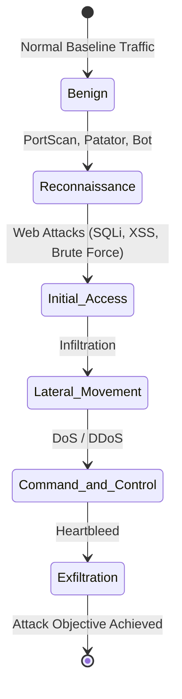
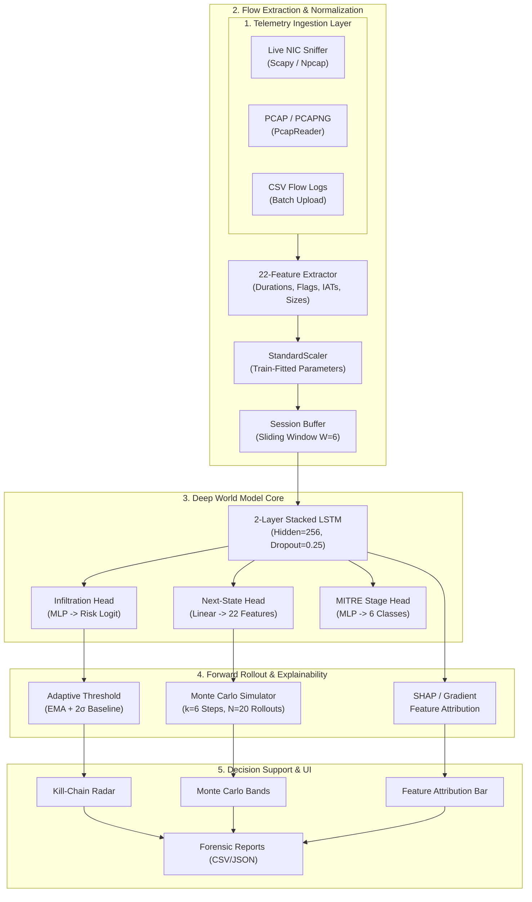

<div align="center">

# Project Garud
### Autonomous Network Attack Forecasting & Deep World Model Telemetry Engine
**SIH 2026 — Problem Statement ID 26153 (National Technical Research Organisation)**
**Team: Code 4 Change • Repository: [Team-Code-4-Chnage/Project-Garud](https://github.com/Team-Code-4-Chnage/Project-Garud)**

[](https://python.org)
[](https://pytorch.org)
[](https://fastapi.tiangolo.com)
[](https://react.dev)
[](https://vitejs.dev)
[](https://attack.mitre.org)
[](https://www.unb.ca/cic/datasets/ids-2017.html)

[Quickstart](#quickstart) • [Architecture](ARCHITECTURE.md) • [Simulation Playbook](SIMULATION.md) • [Presentation Deck](PRESENTATION.md) • [Benchmarks](#benchmark-performance-on-cic-ids2017--cic-ids2018) • [API Reference](#api-endpoints) • [Lab Setup](LAB_SETUP.md)

</div>

---

## Executive Summary

Traditional network intrusion detection is reactive: it flags malicious behavior after a signature or anomalous payload has already crossed the wire. In a Critical Information Infrastructure (CII) or high-assurance enterprise perimeter, that's often too late — data has already been staged, privileges escalated, persistence established.

Project Garud (built around the NetForecast recurrent telemetry engine) takes a different approach. It trains a world model on sliding windows of network flow telemetry, so it predicts the *next* flow-feature vectors before the corresponding packets arrive, rather than only classifying packets already seen. Those predicted trajectories are mapped onto the 6-stage MITRE ATT&CK kill chain, giving an early read on where a session is heading, not just where it currently sits.

A few things this system does, beyond plain classification:

- Monte Carlo rollouts (k=6 steps, N=20 samples) give confidence intervals on the forecast instead of a single point estimate.
- An adaptive EMA threshold (mean + 2 standard deviations, tuned to live background traffic) keeps the alert rate sane instead of firing on every minor fluctuation.
- Any session can be explained on demand: SHAP (sampled Shapley value estimates) and gradient×input attribution both point to the specific telemetry features that drove the score.
- Live sockets are resolved back to local PIDs and executable names (`chrome.exe`, `python.exe`, `powershell.exe`), with IPs classified as host/LAN/NAT.
- Captured flows persist across dashboard tab switches; each monitoring cycle's sessions and alerts are archived to disk on demand and automatically on every backend shutdown.
- Incident reports export as themed HTML, CSV, or JSON for SIEM ingestion or a printable dossier.

---

## Benchmark Performance on CIC-IDS2017 + CIC-IDS2018

Evaluated on 331,048 real-world flows — CIC-IDS2017 (all 8 capture days) plus 7,940 real Lateral
Movement (Infiltration) flows and 928 real Initial Access (Web Attack) flows pulled in from
CIC-IDS2018, plus 2,180 real CIC-IDS2017 Initial Access rows re-chunked into pure attack-only
sessions alongside their original mixed-session form (`data/fix_initial_access_sessions.py` — see
below for why). A session-level 3-way split (1,673 train / 239 validation / 478 test sessions)
means checkpoint selection during training only ever looks at the validation set — the test set
(61,776 six-flow windows from 64,642 test flows) is touched exactly once, for the numbers below.

### Binary detection (malicious vs. benign)

| Model | F1-Score | Precision | Recall | False Positive Rate |
|---|:---:|:---:|:---:|:---:|
| Logistic Regression *(linear baseline)* | 0.523 | 0.689 | 0.421 | 6.16% |
| Isolation Forest *(unsupervised baseline)* | 0.402 | 0.374 | 0.434 | 23.49% |
| NetForecast World Model | **0.862** | **0.859** | **0.864** | **4.59%** |

Source: `backend/artifacts/benchmark_comparison.csv`, at the fixed 0.5 threshold. Measured CPU latency of the shipped model: 1.2 ms per single-window prediction, about 160 ms for a full 6-step forecast with 20 Monte Carlo runs.

### Per-MITRE-stage classification (held-out test set, shipped calibrated model)

| Stage | Precision | Recall | F1 | Test windows |
|---|:---:|:---:|:---:|---:|
| Benign | 0.978 | 0.987 | 0.983 | 46,676 |
| Reconnaissance | 0.934 | 0.911 | 0.922 | 7,116 |
| Initial Access | 0.815 | 0.862 | 0.838 | 623 |
| Lateral Movement | 0.989 | 0.855 | 0.917 | 771 |
| C2 | 0.996 | 0.967 | 0.981 | 6,588 |
| Exfiltration | — | — | — | 2 (covered by signature detector, see below) |

All five learnable stages are now at F1 0.84 or above. Source: `experiments/calibrate_stage_logits.py`; full breakdown, uncalibrated numbers, and history in [`docs/model_card.md`](docs/model_card.md#6-evaluation--comparative-benchmark).

The stage head classifies the stage of the most recent flow in the 6-flow window, which is exactly the flow the live system annotates when it runs the model (`backend/app/ingestion.py`). An earlier version trained it to guess the stage of the *next*, not-yet-seen flow while the dashboard displayed that guess against the current flow. That mismatch was the main reason Initial Access stayed weak for so long: a web-attack request is often one flow surrounded by benign traffic, so it can't be predicted from the benign flows before it. Aligning training with what production actually displays moved Initial Access F1 from 0.530 to 0.838. Forecasting is unaffected: future states still come from the next-state head and the autoregressive Monte Carlo rollout.

Initial Access got there through several verified fixes, in order: real CIC-IDS2018 web-attack data (`data/augment_initial_access.py`), class-weight retuning with focal loss, per-class logit calibration, re-chunking the original CIC-IDS2017 web-attack rows into pure attack-only sessions alongside their mixed-session form (`data/fix_initial_access_sessions.py` — the CIC-IDS2017 CSVs in this repo carry no IP or timestamp columns, so their sessions are fixed-size chunks of consecutive rows that mixed attack rows with benign traffic), and the label-alignment fix above. Two further ideas (gating on the infiltration head, an architectural skip connection) were tested and did not help, so they were not shipped.

The ML model does not detect Exfiltration: CIC-IDS2017 has only about 11 Heartbleed flows in its entire public release (2 in this test set), too few to learn from. Heartbleed is instead covered by a deterministic signature detector (`capture/signatures.py`) that checks the CVE-2014-0160 wire format directly; it's tested against a crafted malicious packet and does not fire on the legitimate TLS, heartbeat, and non-TLS cases in `backend/tests/test_signatures.py`.

We also directly tested generalization to unseen attack tools (`experiments/family_holdout_eval.py`, results in [§9 of the model card](docs/model_card.md#9-generalization-to-unseen-attack-families)): holding an entire attack family out of training, a held-out DoS variant (slowloris) is still correctly flagged 64% of the time, while a held-out botnet family (Bot) and a payload-driven attack (XSS) show no meaningful transfer. That's an honest, uneven result rather than a cherry-picked win.

---

## MITRE ATT&CK Kill-Chain Mapping

NetForecast classifies every network flow and forecasts future progression across a 6-stage taxonomy:



| MITRE Stage | Target ATT&CK Techniques | Training Data (actual labels mapped in) | Detection Path |
|---|---|---|---|
| Benign | N/A (Standard Business Traffic) | CIC-IDS2017 BENIGN | ML stage head |
| Reconnaissance | T1595 (Active Scanning), T1046 (Network Service Discovery) | CIC-IDS2017 PortScan, Bot, FTP-Patator, SSH-Patator | ML stage head |
| Initial Access | T1190 (Exploit Public-Facing App), T1110 (Brute Force) | CIC-IDS2017 + CIC-IDS2018 Web Attack (Brute Force, XSS, SQL Injection) | ML stage head |
| Lateral Movement | T1021 (Remote Services), T1210 (Exploitation of Remote Services) | CIC-IDS2017 + CIC-IDS2018 Infiltration | ML stage head |
| Command & Control | T1071 (Application Layer Protocol), T1573 (Encrypted Channel) | CIC-IDS2017 DDoS, DoS Hulk, GoldenEye, Slowloris, Slowhttptest | ML stage head |
| Exfiltration | T1041 (Exfiltration Over C2), T1048 (Exfiltration Over Alt Protocol) | CIC-IDS2017 Heartbleed (only ~11 real flows exist) | Deterministic Heartbleed signature detector (`capture/signatures.py`) |

Note that "Command & Control" here is learned from CIC-IDS2017's DoS/DDoS traffic (the dataset has no dedicated C2-beaconing label), so it recognizes sustained flood/slow-connection patterns rather than low-and-slow beaconing specifically.

---

## System Architecture



---

## Quickstart

### Prerequisites
- Python 3.11 or 3.12
- Node.js 18+ and npm
- Npcap (Windows only, required for live packet capture)

### Option A: One-Click Launch (Windows PowerShell)

```powershell
powershell -ExecutionPolicy Bypass -File .\start_all.ps1
```
Launches the FastAPI backend on `:8000` (using `backend/venv`'s Python) and the Vite frontend on `:5173`, sets the backend's traffic mode to match `-Mode`, then starts live packet capture (elevated via UAC if needed) or, with `-Mode simulator`, the traffic simulator. Requires `backend/venv` and `frontend/node_modules` to already be installed (see Option B).

---

### Option B: Step-by-Step Manual Setup

#### 1. Backend Service
```bash
# Navigate to backend and create virtualenv
cd backend
python -m venv venv
.\venv\Scripts\activate       # On Linux/macOS: source venv/bin/activate

# Install dependencies
pip install -r requirements.txt

# Start backend with auto-reload
uvicorn app.main:app --reload --host 0.0.0.0 --port 8000
```
- Interactive Swagger UI: [http://localhost:8000/docs](http://localhost:8000/docs)
- Health check: [http://localhost:8000/health](http://localhost:8000/health)

#### 2. Frontend Dashboard
```bash
# Open a new terminal
cd frontend
npm install
npm run dev
```
- Analyst dashboard: [http://localhost:5173](http://localhost:5173)

---

### Option C: Containerized Deployment (Docker Compose)

Spin up the backend (with a persistent data volume and read-only model artifacts) and the Nginx-served frontend build with one command. Live packet capture is not containerized; run `capture/live_capture.py` on the host if you need it.

```bash
# Build and start all services
docker compose up --build -d

# Inspect running services
docker compose ps

# View backend logs
docker compose logs -f backend
```
- Frontend dashboard: [http://localhost:5173](http://localhost:5173)
- FastAPI backend: [http://localhost:8000](http://localhost:8000)

---

## Configuration & Environment Variables

Copy `.env.example` to `.env` to customize runtime parameters:

```bash
cp .env.example .env
```

| Variable | Default Value | Description |
|---|---|---|
| `ARTIFACTS_DIR` | `./backend/artifacts` | Path to serialized model weights, scaler, and config |
| `DB_DIR` | `./backend/data` | SQLite database directory (`forecaster.db`) |
| `ALERT_THRESHOLD` | `0.5` | Baseline probability threshold for attack alerts |
| `ADAPTIVE_THRESHOLD` | `1` | Enable dynamic baseline (mean + 2 std dev) thresholding |
| `API_KEY` | *(None / Empty)* | Optional header authentication (`X-API-Key`). Unset = demo mode |
| `FRONTEND_URL` | `http://localhost:5173` | Allowed CORS origins (comma-separated for multi-origin) |

---

## Running Automated Tests

Run the full backend test suite to verify inference, world model rollout, and explainability:

```bash
# Run all backend tests
backend/venv/Scripts/python.exe -m pytest backend/tests -v

# Run inference and forecast unit tests specifically
backend/venv/Scripts/python.exe -m pytest backend/tests/test_inference.py -v
```

---

## How to Demo (SIH 2026 Evaluation Flow)

A 5-stage workflow for live judge demonstrations:

```
[1. Simulator Mode] --> [2. Observe Forecasting] --> [3. Switch Live NIC] --> [4. Purge Simulated] --> [5. Archive Cycle]
```

1. **Launch in simulator mode.** Run `powershell -File .\start_all.ps1 -Mode simulator`. This starts both servers and immediately starts `demo/traffic_simulator.py`, injecting realistic multi-session attacks across all 6 MITRE stages.
2. **Show forecasting vs. detection.** In the SOC dashboard, show a session progressing through Reconnaissance to Initial Access. Highlight the k-step Monte Carlo forecast panel — it projects state vectors forward and predicts an impending transition to Lateral Movement or C2 before the corresponding attack packets occur.
3. **Inspect dual explainability.** Click the Explain tab on an active alert. Toggle between SHAP (Shapley game-theoretic attributions) and gradient×input attributions to show which flow features (`down_up_ratio`, `pkt_size_avg`, `rst_flag_cnt`, etc.) drove the risk score.
4. **Show live mode and purge.** Switch the system mode to live via the UI or API (`POST /system/mode`). Click "Purge Simulated Data" (`POST /system/purge-simulated`) to wipe synthetic demo flows from the operational database while keeping genuine live traffic.
5. **Cycle reset and archive.** Show the non-destructive telemetry cycle system: trigger "Archive Cycle" (`POST /system/cycle/start`), which snapshots the current state into historical archives (`/system/cycles`) and starts a fresh monitoring session without restarting the server.

## Live Traffic & PCAP Ingestion

### A. Upload PCAP / PCAPNG Files
Drop any standard Wireshark or tcpdump `.pcap` or `.pcapng` file directly into the dashboard UI, or stream via API:
```bash
curl -X POST http://localhost:8000/ingest/pcap \
  -F "file=@sample_attack.pcap"
```

### B. Live NIC Sniffing
Capture and classify live traffic from your physical Ethernet or Wi-Fi interface:
```bash
# List available network interfaces
python capture/live_capture.py --list-interfaces

# Sniff on selected interface and stream flows to backend
python capture/live_capture.py --interface "Ethernet" --api http://localhost:8000
```

---

## Retraining & Experimentation

To reproduce the benchmark or train on custom PCAP/flow data:

```bash
# 1. Download official CIC-IDS2017 dataset (8 CSV files, ~844 MB)
python data/download_cicids.py

# 2. Preprocess with stratified attack preservation & session windowing
python data/preprocess_cicids.py --input-dir data/raw_cicids --output real_flows.csv --sample 40000

# 3. Augment Lateral Movement with real CIC-IDS2018 Infiltration data (~317MB download).
#    CIC-IDS2017 alone has only ~36 real Lateral Movement rows -- not enough to learn
#    from. Optional but strongly recommended; skip only if you don't need that stage.
python data/augment_lateral_movement.py --target real_flows.csv

# 4. Augment Initial Access with real CIC-IDS2018 Web Attack data (~317MB download,
#    same two days). CIC-IDS2017 alone under-represents web-attack diversity.
python data/augment_initial_access.py --target real_flows.csv

# 5. Fix Initial Access's session construction: re-chunks the original CIC-IDS2017
#    web-attack rows into pure attack-only sessions, added alongside (not replacing)
#    the mixed-session rows. See docs/model_card.md section 5 for why this matters --
#    it's the single biggest lever for this stage.
python data/fix_initial_access_sessions.py --target real_flows.csv

# 6. Train MAX-configuration World Model
python pipeline_fixed.py \
  --data real_flows.csv \
  --out ./backend/artifacts \
  --epochs 20 \
  --batch-size 128 \
  --hidden-size 256 \
  --num-layers 2 \
  --dropout 0.25 \
  --lr 1e-3 \
  --weight-decay 1e-4 \
  --augment-stages "Exfiltration" \
  --augment-sessions-per-stage 300 \
  --class-weight-max 6.0 \
  --stage-loss focal \
  --focal-gamma 2.0 \
  --stage-target current

# 7. Recalibrate per-class stage logit bias against the freshly retrained weights
#    (copy the printed "Final bias" dict into backend/artifacts/config.json's
#    stage_logit_bias field by hand -- see experiments/calibrate_stage_logits.py's
#    module docstring for why this stays a manual step).
python experiments/calibrate_stage_logits.py
```

> [!TIP]
> All artifacts are serialized into `backend/artifacts/`:
> - `world_model.pt` — checkpointed LSTM PyTorch weights (hidden=256)
> - `scaler.pkl` — train-split fitted standard scaler
> - `config.json` — hyperparameters, feature indices, calibration bias, and git commit provenance
> - `benchmark_comparison.csv` — head-to-head metrics against baselines

---

## API Endpoints

> [!NOTE]
> All HTTP routes share a single global SlowAPI limit of 120 requests/minute per client IP (`backend/app/main.py`) — there is currently no differentiated per-endpoint throttling.

> [!IMPORTANT]
> `/predict`, `/forecast`, and `/explain` take a `window` of 6 flows × 22 features and by default assume it is **already scaled**. If you send raw flow statistics (as they appear in CIC-IDS CSVs or `real_flows.csv`), add `"needs_scaling": true` to the request body, or the model will see unscaled values and return meaningless predictions. `/ingest`, `/ingest/csv`, and `/ingest/pcap` always scale for you.

| Category | Method | Endpoint | Description |
|:---:|:---:|---|---|
| Health & Info | `GET` | `/health` | System status, device (CPU/CUDA), active features count |
| Forecasting | `POST` | `/predict` | Stage + infiltration probability for one 6x22 window |
| | `POST` | `/forecast` | k-step Monte Carlo rollout (`k_steps` ≤ 20, `n_mc_samples` ≤ 100) with mean, ±σ, and EMA |
| | `GET` | `/forecast/view/html` | Printable in-browser HTML forecast trajectory dossier |
| | `GET` | `/forecast/export/html` | Download themed HTML forecast dossier |
| | `GET` | `/forecast/export/csv` | Download forecast steps as CSV |
| | `GET` | `/forecast/export/json` | Download forecast steps as JSON |
| Explainability | `POST` | `/explain` | Feature attribution (`method: "shap"` or `method: "gradient"`) |
| | `GET` | `/explain/view/html` | Printable in-browser HTML attribution dossier (SHAP/Gradient) |
| | `GET` | `/explain/export/html` | Download themed HTML explanation dossier |
| | `GET` | `/explain/export/csv` | Download feature attributions as CSV |
| | `GET` | `/explain/export/json` | Download feature attributions as JSON |
| Forensic Reports | `GET` | `/reports/view/html` | Printable in-browser HTML incident forensic dossier |
| | `GET` | `/reports/export/html` | Download themed HTML forensic report |
| | `GET` | `/reports/export/csv` | Export forensic CSV report for sessions and alerts |
| | `GET` | `/reports/export/json` | Export full structured JSON telemetry & kill-chain report |
| Ingestion | `POST` | `/ingest` | Ingest single flow telemetry record (simulated-source flows rejected in live mode) |
| | `POST` | `/ingest/csv` | Bulk upload flow log CSV |
| | `POST` | `/ingest/pcap` | Upload raw `.pcap`/`.pcapng` file for Scapy flow reconstruction |
| | `GET` | `/ingest/buffer-status` | Per-session sliding-window buffer fill levels |
| Sessions & Dashboard | `GET` | `/sessions` | Tracked sessions (supports `active_within_seconds` filter) |
| | `GET` | `/sessions/{session_key}/flows` | Flow records for one session |
| | `GET` | `/dashboard/stats` | Aggregate counters for the dashboard header |
| | `GET` | `/dashboard/stage-distribution` | Session counts per MITRE stage |
| System & Cycle | `GET/POST`| `/system/mode` | Query or toggle between `live` and `simulated` modes |
| | `POST` | `/system/simulator/start` | Start the built-in traffic simulator (simulated mode only) |
| | `POST` | `/system/simulator/stop` | Stop the built-in traffic simulator |
| | `POST` | `/system/purge-simulated` | Delete all simulated flows, sessions, and alerts |
| | `GET` | `/system/host-identity` | This machine's hostname, IPs, and adapters |
| | `POST` | `/system/cycle/start` | Archive current monitoring cycle and start a fresh cycle |
| | `GET` | `/system/cycle/current` | Query the currently active monitoring cycle |
| | `GET` | `/system/cycles` | List archived cycles |
| | `GET` | `/system/cycles/{cycle_id}` | One archived cycle's contents |
| Alerts & WS | `GET` | `/alerts` | Query active & historical alerts with triage status |
| | `GET` | `/alerts/stats` | Aggregate alert statistics |
| | `POST` | `/alerts/{alert_id}/acknowledge` | Acknowledge an alert |
| | `WS` | `/ws/live` | WebSocket real-time flow telemetry stream (alias: `/api/packets/ws`) |

---

## Repository Structure

```
Network_Attack_Detection/
├── backend/                         # FastAPI core service
│   ├── app/
│   │   ├── config.py                # Hyperparameters, paths & thresholds
│   │   ├── database.py              # SQLite + async SQLAlchemy session models
│   │   ├── inference.py             # World Model forward pass, MC rollout & SHAP
│   │   ├── ingestion.py             # Sliding window buffer & adaptive EMA threshold
│   │   ├── network_identity.py      # Host discovery & HOST/LAN_PEER/NAT_PEER IP classification
│   │   ├── process_resolver.py      # psutil socket-to-PID & process-name correlation
│   │   ├── signatures.py            # Re-export of capture/signatures.py (Docker/standalone packaging)
│   │   ├── flow_state.py            # Re-export of capture/flow_state.py (Docker/standalone packaging)
│   │   ├── live.py                  # WebSocket broadcast registry shared by ws.py and ingestion.py
│   │   ├── main.py                  # App factory, SlowAPI rate limiter, API-key middleware & CORS
│   │   ├── model_loader.py          # Dynamic artifact loader (hidden_size, scaler, calibration bias)
│   │   ├── schemas.py               # Pydantic request/response validation schemas
│   │   └── routes/                  # Modular endpoint routers
│   │       ├── alerts.py            # Alert triage & acknowledge
│   │       ├── explain.py           # SHAP / Gradient attribution & HTML/CSV/JSON dossiers
│   │       ├── forecast.py          # MC rollout & HTML/CSV/JSON dossiers
│   │       ├── predict.py           # Single-window prediction
│   │       ├── ingest.py            # Single & batch flow ingestion (mode-gated)
│   │       ├── pcap.py              # Scapy PcapReader flow reconstruction
│   │       ├── reports.py           # Forensic HTML dossiers & CSV/JSON exports
│   │       ├── system.py            # Mode switcher, simulator control, purge & cycle archive
│   │       └── ws.py                # WebSocket stream, sessions & dashboard endpoints
│   ├── artifacts/                   # Serialized production models & metrics
│   │   ├── benchmark_comparison.csv # Baseline comparison table
│   │   ├── config.json              # Model hyperparameters, calibration bias & provenance
│   │   ├── scaler.pkl               # StandardScaler fitted on training set
│   │   └── world_model.pt           # Checkpointed PyTorch LSTM weights (256 units)
│   └── tests/
│       ├── test_inference.py        # Model/inference/explainability/calibration unit tests
│       ├── test_api_integration.py  # End-to-end API, ingestion & Heartbleed-alert flow tests
│       ├── test_flow_parity.py      # PCAP vs live-capture feature-extraction parity tests
│       ├── test_signatures.py       # Deterministic Heartbleed (CVE-2014-0160) signature tests
│       ├── test_model_quality.py    # Real-data QA: per-stage capability, forecast, regression guard
│       └── fixtures/                # Real held-out flows used by test_model_quality.py
│       # 55 tests total, currently passing
├── frontend/                        # React 19 + Vite 8 SOC Dashboard
│   ├── src/
│   │   ├── components/
│   │   │   ├── Dashboard.jsx        # Stat cards, active sessions & active-attacks tabs
│   │   │   ├── SessionTable.jsx     # Session / attack tables with 1-click forecast
│   │   │   ├── LiveLogsView.jsx     # Attack-only live log feed in column layout
│   │   │   ├── ForecastView.jsx     # Monte Carlo forecast chart (±1σ band), ETA, kill chain
│   │   │   ├── ExplainView.jsx      # SHAP / Gradient attribution toggle & charts
│   │   │   ├── AlertPanel.jsx       # Alert triage & acknowledge
│   │   │   ├── ReportsView.jsx      # Forensic report viewer & CSV/JSON/HTML export
│   │   │   ├── UploadPanel.jsx      # PCAP & CSV upload
│   │   │   ├── SettingsPanel.jsx    # Traffic mode, simulator control, model info
│   │   │   ├── StageDistributionChart.jsx # Sessions per MITRE stage
│   │   │   └── Badges.jsx           # Shared badges & network wellbeing modal
│   │   ├── api.js                   # fetch-based API client with optional X-API-Key
│   │   ├── utils.js                 # Stage colors & shared formatting helpers
│   │   └── App.jsx                  # Layout, navigation & WebSocket state
├── data/                            # Dataset management & preprocessing
│   ├── download_cicids.py           # Hugging Face mirror chunked downloader
│   ├── preprocess_cicids.py         # 22-feature mapper with stratified sampling
│   ├── augment_lateral_movement.py  # Real CIC-IDS2018 Infiltration data -> Lateral Movement
│   ├── augment_initial_access.py    # Real CIC-IDS2018 Web Attack data -> Initial Access
│   ├── fix_initial_access_sessions.py # Real CIC-IDS2017 web-attack rows, re-chunked into pure sessions
│   ├── raw_cicids/                  # 8 official CIC-IDS2017 CSV files (844 MB)
│   └── raw_cicids2018/              # CIC-IDS2018 infiltration-day and web-attack-day CSVs
├── experiments/                     # Side experiments, not part of the shipped model
│   ├── family_holdout_eval.py       # Unseen-attack-family generalization test
│   └── calibrate_stage_logits.py    # Post-hoc per-class logit-bias calibration search
├── capture/                         # Hardware & network capture tools
│   ├── live_capture.py              # Scapy-based live sniffer on Ethernet/Wi-Fi
│   ├── flow_state.py                # Shared 22-feature flow reconstruction (live capture + PCAP)
│   └── signatures.py                # Deterministic packet signatures (Heartbleed CVE-2014-0160)
├── demo/                            # Simulation & demo harnesses
│   └── traffic_simulator.py         # Multi-session kill-chain attack injector
├── pipeline_fixed.py                # MAX-configuration training pipeline
├── start_all.ps1                    # Unified single-command launcher
├── ARCHITECTURE.md                  # Architectural specification
├── PRESENTATION.md                  # SIH 2026 pitch deck
├── LAB_SETUP.md                     # Isolated VM lab guide for attack traffic
└── README.md                        # Project documentation
```

---

## Known Limitations & Enterprise Architecture Roadmap

For national-scale deployment or production CII environments, some architectural choices made for this prototype have a clear production upgrade path:

1. **Embedded datastore (SQLite + WAL mode).** Currently async SQLite (`sqlite+aiosqlite`) gives a self-contained, zero-external-dependency deployment for the hackathon prototype, without needing a local PostgreSQL service. In a 10Gbps+ enterprise perimeter, the database layer would move to a distributed time-series store such as TimescaleDB or ClickHouse, with Kafka ingestion buffering to handle millions of flows per second.
2. **Local transport security (HTTP/WS).** Currently plaintext HTTP and WebSocket (`ws://`) for local development and offline evaluator testing. In production, an Nginx or Traefik reverse proxy would handle TLS 1.3 / mTLS termination with strict HSTS headers and secure WebSockets (`wss://`).
3. **Capture privileges.** Currently Windows native raw socket packet capture requires administrator elevation (`RunAs`). In a production appliance, packet capture would run as a dedicated Linux system daemon using eBPF/AF_XDP or DPDK ring buffers with minimal Linux capabilities (`CAP_NET_RAW`, `CAP_NET_ADMIN`).

---

<div align="center">
  <sub>Built for the Smart India Hackathon (SIH) 2026 • National Technical Research Organisation (NTRO) • Problem Statement ID 26153</sub>
</div>
