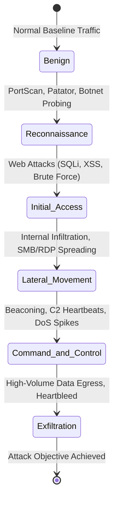
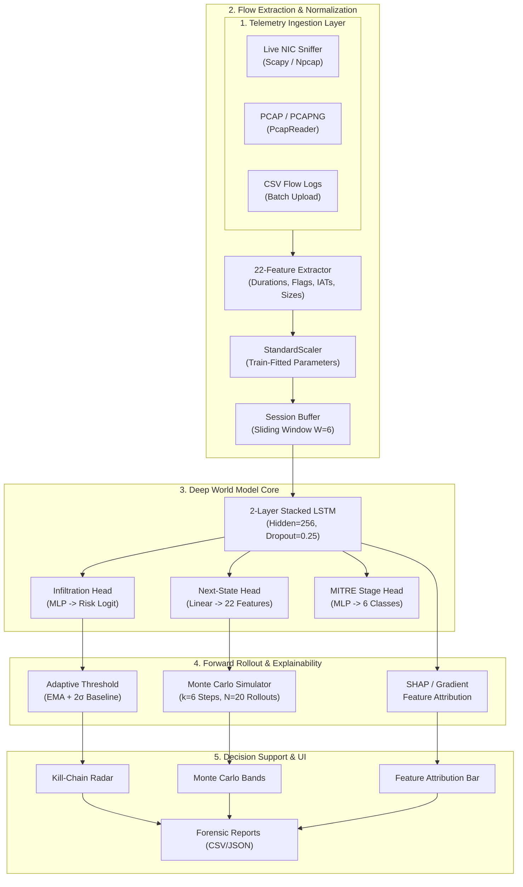

<div align="center">

# 🦅 Project Garud
### Autonomous Network Attack Forecasting & Deep World Model Telemetry Engine
**SIH 2026 — Problem Statement ID 26153 (National Technical Research Organisation)**  
**Team: Code 4 Change • Repository: [Team-Code-4-Chnage/Project-Garud](https://github.com/Team-Code-4-Chnage/Project-Garud)**

[](https://python.org)
[](https://pytorch.org)
[](https://fastapi.tiangolo.com)
[](https://react.dev)
[](https://vitejs.dev)
[](https://attack.mitre.org)
[](https://www.unb.ca/cic/datasets/ids-2017.html)

<p align="center">
  <strong>Anticipate attacker progression before compromise is completed.</strong><br>
  <em>Multi-head recurrent World Model • Autoregressive Monte Carlo rollouts • SHAP & Gradient explainability • Real-time PCAP & live packet ingestion</em>
</p>

[Quickstart](#-quickstart) • [Architecture](ARCHITECTURE.md) • [Simulation Playbook](SIMULATION.md) • [Presentation Deck](PRESENTATION.md) • [Benchmarks](#-benchmark-performance-on-cic-ids2017) • [API Reference](#-api-endpoints) • [Lab Setup](LAB_SETUP.md)

</div>

---

## 📌 Executive Summary

Traditional Network Intrusion Detection Systems (NIDS) are **reactive**: they flag malicious behavior only after a malicious signature or anomalous payload has already crossed the wire. In Critical Information Infrastructure (CII) and high-assurance enterprise perimeters, this detection is often **too late** — data has been staged, privilege escalated, and persistence established.

**Project Garud** (powered by the **NetForecast** deep recurrent telemetry engine) introduces a **World Model** for network defense:
1. **Learns Temporal State Dynamics:** Embeds sliding windows of network flow telemetry into latent space.
2. **Forecasts Future Network States:** Predicts future flow feature vectors $\hat{s}_{t+1}, \dots, \hat{s}_{t+k}$ before packets arrive.
3. **Anticipates Attack Progression:** Maps trajectory to the 6-stage **MITRE ATT&CK** kill chain.
4. **Quantifies Uncertainty:** Uses stochastic **Monte Carlo Rollouts** to deliver confidence intervals to security operators.
5. **Prevents Alert Fatigue:** Computes a dynamic **Adaptive EMA Threshold** ($\bar{p} + 2\sigma$) tuned to live background traffic.
6. **Explains Every Decision:** Dual **SHAP** (Shapley Additive exPlanations) and **Gradient $\times$ Input** attributions pinpoint the exact telemetry features driving risk.
7. **Resolves Process & Network Identity:** Correlates live socket 5-tuples to local PIDs and executable names (`chrome.exe`, `python.exe`, `nmap.exe`) with topological IP classification.
8. **Preserves Continuous Telemetry Cycles:** Non-destructive state persistence across server hot-reloads and window switches with on-demand cycle archiving.
9. **Generates Themed Forensic Dossiers:** 1-click in-browser printable incident reports and SIEM exports (HTML, CSV, JSON) formatted in NetForecast's SOC cream & burnt orange design.

---

## 📊 Benchmark Performance on CIC-IDS2017 + CIC-IDS2018

Evaluated on **327,940 real-world flows** — 320,000 from **CIC-IDS2017** (all 8 capture days) plus
7,940 real Lateral Movement (Infiltration) flows from **CIC-IDS2018**'s two dedicated infiltration
days, added because CIC-IDS2017 alone only has ~36 real Lateral Movement examples in its entire
public release (see `data/augment_lateral_movement.py`). 269,974 training rows (including train-only
synthetic oversampling of Exfiltration only, see below) and 61,566 **100% real, untouched** test
rows, across 2,001 real sessions.

| Model Architecture | F1-Score | Precision | Recall (Detection Rate) | False Positive Rate (FPR) | Latency (Inference, CPU) |
|---|:---:|:---:|:---:|:---:|:---:|
| **Logistic Regression** *(Linear Baseline)* | 0.562 | 0.689 | 0.475 | 7.12% | < 1 ms |
| **Isolation Forest** *(Unsupervised Baseline)* | 0.362 | 0.333 | 0.396 | 26.29% | ~ 8 ms |
| **NetForecast World Model** *(Proposed, MAX Config)* | **0.861** | **0.848** | **0.875** | **5.20%** | **~ 0.7 ms** (measured, single-window forward pass) |

> [!IMPORTANT]
> **Key Operational Findings (binary malicious-vs-benign detection):**
> - Class-weighted cross-entropy (clipped to 15x, tuned down from an earlier 50x that over-corrected) and positive-weighted BCE (`pos_weight≈2.98`) give **87.5% recall** at the binary detection level with a **5.20% FPR**, avoiding the alert fatigue of the Isolation Forest baseline (26.29% FPR).
> - **Leakage-Free Validation:** Strict session-level train/test split. The standard scaler is fitted strictly on training sessions — zero test-set information leaks into the normalization parameters.
>
> **Per-MITRE-stage capability — read this before quoting the binary numbers above as "detects all attacks":**
> Benign/Reconnaissance/C2 are reliably classified (F1 0.75–0.94). **Lateral Movement is now reliably detected (Precision 83%, Recall 93%, F1 0.88 on 900 real held-out test flows)** — real CIC-IDS2018 Infiltration data replaced the earlier synthetic-oversampling attempt, which a held-out evaluation confirmed did not transfer to real traffic. Initial Access (web attacks) has real recall (64%) but weak precision (14%) — it over-fires. **The ML model does not detect Exfiltration (0% recall)** — CIC-IDS2017 only has ~11 Heartbleed flows in its entire public release (2 in this sample), too little to learn from — but **Exfiltration/Heartbleed is separately covered by a deterministic signature detector** (`capture/signatures.py`) that doesn't rely on ML at all: CVE-2014-0160 has a fixed wire-format signature, verified end-to-end against a crafted malicious packet with zero false positives on legitimate traffic. Full per-stage numbers and root-cause analysis are in [`docs/model_card.md`](docs/model_card.md#6-evaluation--comparative-benchmark).

---

## 🎯 MITRE ATT&CK Kill-Chain Mapping

NetForecast classifies every network flow and forecasts future progression across a 6-stage taxonomy:



| MITRE Stage | Target ATT&CK Techniques | CIC-IDS2017 Mapped Attacks | Key Telemetry Signatures |
|---|---|---|---|
| **Benign** | N/A (Standard Business Traffic) | Normal HTTP/S, DNS, SSH | Balanced flow rates, standard TCP flags |
| **Reconnaissance** | T1595 (Active Scanning), T1046 (Network Service Discovery) | PortScan, Bot, FTP-Patator, SSH-Patator | High SYN/RST flag counts, small packet sizes, rapid IAT |
| **Initial Access** | T1190 (Exploit Public-Facing App), T1110 (Brute Force) | Web Attack (SQL Injection, XSS, Brute Force) | Asymmetric forward packet size, PSH flags, repeated requests |
| **Lateral Movement** | T1021 (Remote Services), T1210 (Exploitation of Remote Services) | Infiltration, Internal SMB/RDP scans | Internal IP-to-IP bursts, header length variance spikes |
| **Command & Control** | T1071 (Application Layer Protocol), T1573 (Encrypted Channel) | DDoS LOIC, DoS Hulk, DoS GoldenEye, Slowloris | Periodic IAT intervals, persistent window size, flood volumes |
| **Exfiltration** | T1041 (Exfiltration Over C2), T1048 (Exfiltration Over Alt Protocol) | Heartbleed, Data exfiltration egress | Skewed down/up ratio, high backward packet lengths, TCP window changes |

---

## ⚡ System Architecture



---

## 🚀 Quickstart

### Prerequisites
- **Python 3.11 or 3.12**
- **Node.js 18+ & npm**
- **Npcap** *(Windows only, required for live packet capture)*

### Option A: One-Click Launch (Windows PowerShell)

```powershell
powershell -ExecutionPolicy Bypass -File .\start_all.ps1
```
*Automatically activates virtual environment, verifies model artifacts, launches FastAPI backend on `:8000`, and Vite frontend on `:5173`.*

---

### Option B: Step-by-Step Manual Setup

#### 1. Backend Service
```bash
# Navigate to backend and create virtualenv
cd backend
python -m venv venv
.\venv\Scripts\activate       # On Linux/macOS: source venv/bin/activate

# Install dependencies
pip install -r requirements.txt

# Start backend with auto-reload
uvicorn app.main:app --reload --host 0.0.0.0 --port 8000
```
- Interactive Swagger UI: [http://localhost:8000/docs](http://localhost:8000/docs)
- Health Check: [http://localhost:8000/health](http://localhost:8000/health)

#### 2. Frontend Dashboard
```bash
# Open a new terminal
cd frontend
npm install
npm run dev
```
- Analyst Dashboard: [http://localhost:5173](http://localhost:5173)

---

### Option C: Containerized Deployment (Docker Compose)

Spin up the entire stack (FastAPI backend + Vite/Nginx frontend + shared volume) with a single command:

```bash
# Build and start all services
docker compose up --build -d

# Inspect running services
docker compose ps

# View backend logs
docker compose logs -f backend
```
- Frontend Dashboard: [http://localhost:5173](http://localhost:5173)
- FastAPI Backend: [http://localhost:8000](http://localhost:8000)

---

## ⚙️ Configuration & Environment Variables

Copy `.env.example` to `.env` to customize runtime parameters:

```bash
cp .env.example .env
```

| Variable | Default Value | Description |
|---|---|---|
| `ARTIFACTS_DIR` | `./backend/artifacts` | Path to serialized model weights, scaler, and config |
| `DB_DIR` | `./backend/data` | SQLite database directory (`forecaster.db`) |
| `ALERT_THRESHOLD` | `0.5` | Baseline probability threshold for attack alerts |
| `ADAPTIVE_THRESHOLD` | `1` | Enable dynamic baseline ($\bar{p} + 2\sigma$) thresholding |
| `API_KEY` | *(None / Empty)* | Optional header authentication (`X-API-Key`). Unset = Demo Mode |
| `FRONTEND_URL` | `http://localhost:5173` | Allowed CORS origins (comma-separated for multi-origin) |

---

## 🧪 Running Automated Tests

Run the full backend test suite to verify inference, world model rollout, and explainability:

```bash
# Run all backend tests
backend/venv/Scripts/python.exe -m pytest backend/tests -v

# Run inference and forecast unit tests specifically
backend/venv/Scripts/python.exe -m pytest backend/tests/test_inference.py -v
```

---

## 🎬 How to Demo (SIH 2026 Evaluation Flow)

Follow this 5-stage workflow for live judge demonstrations:

```
[1. Simulator Mode] ──> [2. Observe Forecasting] ──> [3. Switch Live NIC] ──> [4. Purge Simulated] ──> [5. Archive Cycle]
```

1. **Launch in Simulator Mode:**  
   Execute `powershell -File .\start_all.ps1 -Mode simulator`. This launches both servers and immediately starts `demo/traffic_simulator.py` injecting realistic multi-session attacks across all 6 MITRE stages.
2. **Demonstrate Forecasting vs. Detection:**  
   In the SOC Dashboard, show a session progressing through `Reconnaissance` $\to$ `Initial Access`. Highlight the **$k$-Step Monte Carlo Forecast** panel to show the model projecting state vectors into the future and predicting an impending transition to `Lateral Movement` or `C2` *before* the attack packets occur.
3. **Inspect Dual Explainability:**  
   Click the **Explain** tab on an active alert. Toggle between **SHAP** (Shapley game-theoretic attributions) and **Gradient $\times$ Input** attributions to demonstrate to judges which flow features (e.g., `down_up_ratio`, `pkt_size_avg`, `rst_flag_cnt`) triggered the risk score.
4. **Demonstrate Live Mode & Purge:**  
   Switch the system mode to live via the UI or API (`POST /system/mode`). Click **"Purge Simulated Data"** (`POST /system/purge-simulated`) to wipe synthetic demo flows from the operational database while preserving genuine live traffic.
5. **Cycle Reset & Archive:**  
   Show the non-destructive telemetry cycle system: trigger **Archive Cycle** (`POST /system/cycle/start`), which snaps the current state into historical archives (`/system/cycles`) and starts a fresh monitoring session without restarting the server.

## 📡 Live Traffic & PCAP Ingestion

### A. Upload PCAP / PCAPNG Files
Drop any standard Wireshark / tcpdump `.pcap` or `.pcapng` file directly into the dashboard UI, or stream via API:
```bash
curl -X POST http://localhost:8000/ingest/pcap \
  -F "file=@sample_attack.pcap" \
  -F "session_id=incident_042"
```

### B. Live NIC Sniffing
Capture and classify live traffic from your physical Ethernet or Wi-Fi interface:
```bash
# List available network interfaces
python capture/live_capture.py --list-interfaces

# Sniff on selected interface and stream flows to backend
python capture/live_capture.py --interface "Ethernet" --api http://localhost:8000
```

---

## 🔬 Retraining & Experimentation

To reproduce the benchmark or train on custom PCAP/flow data:

```bash
# 1. Download official CIC-IDS2017 dataset (8 CSV files, ~844 MB)
python data/download_cicids.py

# 2. Preprocess with stratified attack preservation & session windowing
python data/preprocess_cicids.py --input-dir data/raw_cicids --output real_flows.csv --sample 40000

# 3. Augment Lateral Movement with real CIC-IDS2018 Infiltration data (~317MB download).
#    CIC-IDS2017 alone has only ~36 real Lateral Movement rows -- not enough to learn
#    from. Optional but strongly recommended; skip only if you don't need that stage.
python data/augment_lateral_movement.py --target real_flows.csv

# 4. Train MAX-Configuration World Model
python pipeline_fixed.py \
  --data real_flows.csv \
  --out ./backend/artifacts \
  --epochs 20 \
  --batch-size 128 \
  --hidden-size 256 \
  --num-layers 2 \
  --dropout 0.25 \
  --lr 1e-3 \
  --weight-decay 1e-4 \
  --augment-stages "Exfiltration" \
  --augment-sessions-per-stage 300 \
  --class-weight-max 15.0
```

> [!TIP]
> All artifacts are dynamically serialized into `backend/artifacts/`:
> - `world_model.pt` — Checkpointed LSTM PyTorch weights (hidden=256)
> - `scaler.pkl` — Train-split fitted standard scaler
> - `config.json` — Hyperparameters, feature indices, and git commit provenance
> - `benchmark_comparison.csv` — Head-to-head metrics against baselines

---

## 🔌 API Endpoints

> [!NOTE]
> All HTTP routes share a single global SlowAPI limit of **120 requests/minute per client IP** (`backend/app/main.py`) — there is currently no differentiated per-endpoint throttling.

| Category | Method | Endpoint | Description |
|:---:|:---:|---|---|
| **Health & Info** | `GET` | `/health` | System status, device (CPU/CUDA), active features count |
| **Forecasting** | `POST` | `/predict` | Single-step state transition & stage prediction from $6 \times 22$ window |
| | `POST` | `/forecast` | $k$-step Monte Carlo rollout with uncertainty intervals & EMA |
| | `GET` | `/forecast/view/html` | Printable in-browser HTML forecast trajectory dossier |
| | `GET` | `/forecast/export/html` | Download themed HTML forecast dossier |
| | `GET` | `/forecast/export/csv` | Download forecast steps as CSV |
| | `GET` | `/forecast/export/json` | Download forecast steps as JSON |
| **Explainability** | `POST` | `/explain` | Feature attribution (`method: "shap"` or `method: "gradient"`) |
| | `GET` | `/explain/view/html` | Printable in-browser HTML attribution dossier (SHAP/Gradient) |
| | `GET` | `/explain/export/html` | Download themed HTML explanation dossier |
| | `GET` | `/explain/export/csv` | Download feature attributions as CSV |
| | `GET` | `/explain/export/json` | Download feature attributions as JSON |
| **Forensic Reports** | `GET` | `/reports/view/html` | Printable in-browser HTML incident forensic dossier |
| | `GET` | `/reports/export/html` | Download themed HTML forensic report |
| | `GET` | `/reports/export/csv` | Export forensic CSV report for sessions and alerts |
| | `GET` | `/reports/export/json` | Export full structured JSON telemetry & kill-chain report |
| **Ingestion** | `POST` | `/ingest` | Ingest single flow telemetry record (gated by mode) |
| | `POST` | `/ingest/csv` | Bulk upload flow log CSV |
| | `POST` | `/ingest/pcap` | Upload raw `.pcap` file for Scapy flow reconstruction |
| **System & Cycle** | `GET/POST`| `/system/mode` | Query or toggle between `live` and `simulated` modes |
| | `POST` | `/system/purge-simulated` | Delete all simulated flows, sessions, and alerts |
| | `POST` | `/system/cycle/start` | Archive current monitoring cycle and start a fresh cycle |
| | `GET` | `/system/cycle/current` | Query the currently active monitoring cycle |
| | `GET` | `/system/cycles` | List historical cycle archives |
| **Alerts & WS** | `GET` | `/alerts` | Query active & historical alerts with triage status |
| | `GET` | `/alerts/stats` | Aggregate alert statistics |
| | `POST` | `/alerts/{id}/acknowledge` | Acknowledge alert with operator notes |
| | `WS` | `/ws/live` | WebSocket real-time flow telemetry stream |

---

## 📂 Repository Structure

```
Network_Attack_Detection/
├── backend/                         # FastAPI core service
│   ├── app/
│   │   ├── config.py                # Hyperparameters, paths & thresholds
│   │   ├── database.py              # SQLite + async SQLAlchemy session models
│   │   ├── inference.py             # World Model forward pass, MC rollout & SHAP
│   │   ├── ingestion.py             # Sliding window buffer & Adaptive EMA threshold
│   │   ├── network_identity.py      # IP subnetting & loopback/private-range classification
│   │   ├── process_resolver.py      # Cross-platform (psutil) socket-to-PID & executable correlation
│   │   ├── signatures.py            # Re-export of capture/signatures.py (Docker/standalone packaging)
│   │   ├── main.py                  # App factory, SlowAPI rate limiter & CORS
│   │   ├── model_loader.py          # Dynamic artifact loader (hidden_size, scaler)
│   │   ├── schemas.py               # Pydantic request/response validation schemas
│   │   └── routes/                  # Modular endpoint routers
│   │       ├── alerts.py            # Alert triage & acknowledge
│   │       ├── explain.py           # SHAP / Gradient attribution & HTML/CSV/JSON dossiers
│   │       ├── forecast.py          # Prediction, MC rollout & HTML/CSV/JSON dossiers
│   │       ├── ingest.py            # Single & batch flow ingestion (mode-gated)
│   │       ├── pcap.py              # Scapy PcapReader flow reconstruction
│   │       ├── reports.py           # Forensic HTML dossiers & CSV/JSON exports
│   │       ├── system.py            # Mode switcher, purge & cycle reset/persistence/archive
│   │       └── ws.py                # Real-time WebSocket event broadcaster
│   ├── artifacts/                   # Serialized production models & metrics
│   │   ├── benchmark_comparison.csv # Baseline comparison table
│   │   ├── config.json              # Model hyperparameters & provenance
│   │   ├── scaler.pkl               # StandardScaler fitted on training set
│   │   └── world_model.pt           # Checkpointed PyTorch LSTM weights (256 units)
│   └── tests/
│       ├── test_inference.py        # 15 model/inference/explainability unit tests
│       ├── test_api_integration.py  # End-to-end API, ingestion & Heartbleed-alert flow tests
│       ├── test_flow_parity.py      # PCAP vs live-capture feature-extraction parity tests
│       └── test_signatures.py       # Deterministic Heartbleed (CVE-2014-0160) signature tests
│       # 34 tests total, 100% pass
├── frontend/                        # React 18 + Vite SOC Dashboard
│   ├── src/
│   │   ├── components/              # Reusable UI components
│   │   │   ├── AlertFeed.jsx        # Live alert feed with triage buttons
│   │   │   ├── ExplainView.jsx      # SHAP / Gradient attribution toggle & charts
│   │   │   ├── ForecastChart.jsx    # Recharts Monte Carlo uncertainty bands
│   │   │   ├── IngestPanel.jsx      # PCAP & CSV upload interface
│   │   │   ├── KillChainTracker.jsx # Visual 6-stage ATT&CK progress radar
│   │   │   └── ReportsView.jsx      # CSV/JSON forensic report downloaders
│   │   ├── api.js                   # Axios client with auth & error handling
│   │   └── App.jsx                  # Main dashboard layout & state management
├── data/                            # Dataset management & preprocessing
│   ├── download_cicids.py           # Hugging Face mirror chunked downloader
│   ├── preprocess_cicids.py         # 22-feature mapper with stratified sampling
│   ├── augment_lateral_movement.py  # Real CIC-IDS2018 Infiltration data -> Lateral Movement
│   ├── raw_cicids/                  # 8 official CIC-IDS2017 CSV files (844 MB)
│   └── raw_cicids2018/              # 2 CIC-IDS2018 infiltration-day CSVs (~317 MB)
├── capture/                         # Hardware & network capture tools
│   ├── live_capture.py              # Scapy-based live sniffer on Ethernet/Wi-Fi
│   ├── flow_state.py                # Shared 22-feature flow reconstruction (live capture + PCAP)
│   └── signatures.py                # Deterministic packet signatures (Heartbleed CVE-2014-0160)
├── demo/                            # Simulation & demo harnesses
│   └── traffic_simulator.py         # Multi-session kill-chain attack injector
├── pipeline_fixed.py                # MAX-configuration training pipeline
├── start_all.ps1                    # Unified single-command launcher
├── ARCHITECTURE.md                  # Comprehensive architectural specification
├── PRESENTATION.md                  # 5-Slide SIH 2026 pitch deck
├── LAB_SETUP.md                     # Isolated VM lab guide for attack traffic
└── README.md                        # Project documentation
```

---

## ⚠️ Known Limitations & Enterprise Architecture Roadmap

For national-scale deployment or production CII (Critical Information Infrastructure) environments, the following architectural choices were made for the prototype/demonstration and map directly to production upgrades:

1. **Embedded Datastore (SQLite + WAL Mode):**  
   - *Current State:* Asynchronous SQLite (`sqlite+aiosqlite`) is used for the hackathon prototype to provide a self-contained, zero-external-dependency deployment without requiring a local PostgreSQL service.
   - *Production Roadmap:* In 10Gbps+ enterprise perimeters, the database layer transitions to a distributed time-series datastore such as **TimescaleDB** or **ClickHouse** with Kafka ingestion buffering to handle millions of flows/sec.
2. **Local Transport Security (HTTP/WS):**  
   - *Current State:* Plaintext HTTP and WebSocket (`ws://`) are configured for local development and offline evaluator sandbox testing.
   - *Production Roadmap:* In production perimeters, an Nginx or Traefik reverse proxy handles **TLS 1.3 / mTLS** termination with strict HSTS headers and secure WebSockets (`wss://`).
3. **Capture Privileges:**  
   - *Current State:* Windows native raw socket packet capture requires Administrator elevation (`RunAs`).
   - *Production Roadmap:* In production appliances, packet capture runs as a dedicated Linux system daemon leveraging **eBPF / AF_XDP** or **DPDK** ring buffers with minimal Linux capabilities (`CAP_NET_RAW`, `CAP_NET_ADMIN`).

---

<div align="center">
  <sub>Built for the <strong>Smart India Hackathon (SIH) 2026</strong> • National Technical Research Organisation (NTRO) • Problem Statement ID 26153</sub>
</div>
