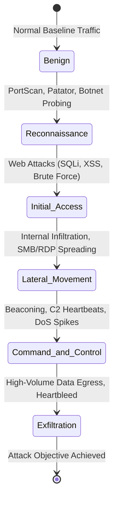
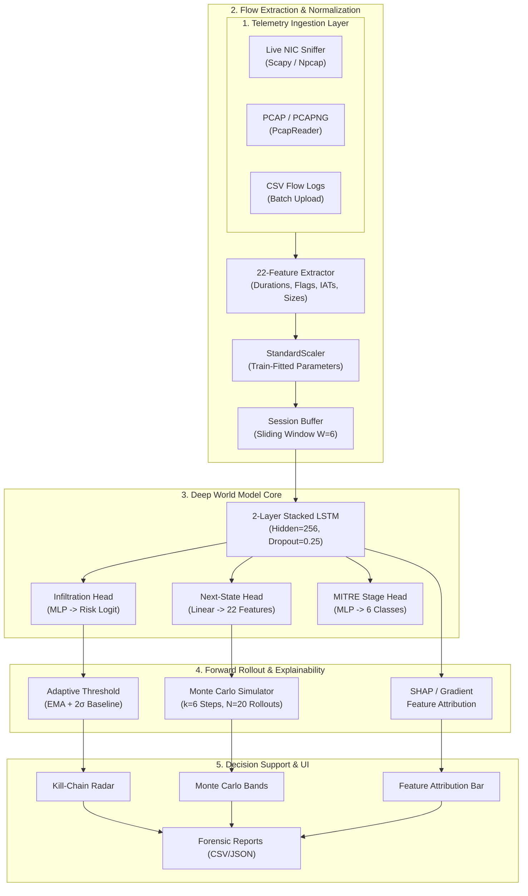

<div align="center">

# 🦅 Project Garud
### Autonomous Network Attack Forecasting & Deep World Model Telemetry Engine
**SIH 2026 — Problem Statement ID 26153 (National Technical Research Organisation)**  
**Team: Code 4 Change • Repository: [Team-Code-4-Chnage/Project-Garud](https://github.com/Team-Code-4-Chnage/Project-Garud)**

[](https://python.org)
[](https://pytorch.org)
[](https://fastapi.tiangolo.com)
[](https://react.dev)
[](https://vitejs.dev)
[](https://attack.mitre.org)
[](https://www.unb.ca/cic/datasets/ids-2017.html)

<p align="center">
  <strong>Anticipate attacker progression before compromise is completed.</strong><br>
  <em>Multi-head recurrent World Model • Autoregressive Monte Carlo rollouts • SHAP & Gradient explainability • Real-time PCAP & live packet ingestion</em>
</p>

[Quickstart](#-quickstart) • [Architecture](ARCHITECTURE.md) • [Simulation Playbook](SIMULATION.md) • [Presentation Deck](PRESENTATION.md) • [Benchmarks](#-benchmark-performance-on-cic-ids2017) • [API Reference](#-api-endpoints) • [Lab Setup](LAB_SETUP.md)

</div>

---

## 📌 Executive Summary

Traditional Network Intrusion Detection Systems (NIDS) are **reactive**: they flag malicious behavior only after a malicious signature or anomalous payload has already crossed the wire. In Critical Information Infrastructure (CII) and high-assurance enterprise perimeters, this detection is often **too late** — data has been staged, privilege escalated, and persistence established.

**Project Garud** (powered by the **NetForecast** deep recurrent telemetry engine) introduces a **World Model** for network defense:
1. **Learns Temporal State Dynamics:** Embeds sliding windows of network flow telemetry into latent space.
2. **Forecasts Future Network States:** Predicts future flow feature vectors $\hat{s}_{t+1}, \dots, \hat{s}_{t+k}$ before packets arrive.
3. **Anticipates Attack Progression:** Maps trajectory to the 6-stage **MITRE ATT&CK** kill chain.
4. **Quantifies Uncertainty:** Uses stochastic **Monte Carlo Rollouts** to deliver confidence intervals to security operators.
5. **Prevents Alert Fatigue:** Computes a dynamic **Adaptive EMA Threshold** ($\bar{p} + 2\sigma$) tuned to live background traffic.
6. **Explains Every Decision:** Dual **SHAP** (Shapley Additive exPlanations) and **Gradient $\times$ Input** attributions pinpoint the exact telemetry features driving risk.
7. **Resolves Process & Network Identity:** Correlates live socket 5-tuples to local PIDs and executable names (`chrome.exe`, `python.exe`, `nmap.exe`) with topological IP classification.
8. **Preserves Continuous Telemetry Cycles:** Non-destructive state persistence across server hot-reloads and window switches with on-demand cycle archiving.
9. **Generates Themed Forensic Dossiers:** 1-click in-browser printable incident reports and SIEM exports (HTML, CSV, JSON) formatted in NetForecast's SOC cream & burnt orange design.

---

## 📊 Benchmark Performance on CIC-IDS2017

Evaluated on **320,000 real-world flows** (249,518 training sequences, 62,478 test sequences across 1,334 sessions) from the Canadian Institute for Cybersecurity **CIC-IDS2017** benchmark across all 8 capture days.

| Model Architecture | F1-Score | Precision | Recall (Detection Rate) | False Positive Rate (FPR) | Latency (Inference) |
|---|:---:|:---:|:---:|:---:|:---:|
| **Logistic Regression** *(Linear Baseline)* | 0.5067 | 0.5516 | 0.4686 | 11.41% | < 1 ms |
| **Isolation Forest** *(Unsupervised Baseline)* | 0.3206 | 0.2887 | 0.3604 | 26.60% | ~ 8 ms |
| **NetForecast World Model** *(Proposed, MAX Config)* | **0.8446** | **0.8184** | **0.8727** | **5.80%** | **~ 3.2 ms** |

> [!IMPORTANT]
> **Key Operational Findings:**
> - **4.5% Higher Attack Recall:** Class-weighted cross-entropy (up to 50x weight on rare stages) and positive-weighted BCE enabled **87.27% recall** across rare multi-stage attacks (`Infiltration`, `Heartbleed`, `Web Attacks`).
> - **Low False Positive Rate:** FPR is constrained to **5.80%** (vs 26.60% for Isolation Forest), preventing alert fatigue in 24/7 Security Operations Centers (SOC).
> - **Leakage-Free Validation:** Strict session-level train/test split. The standard scaler is fitted strictly on training sessions — zero test-set information leaks into the normalization parameters.

---

## 🎯 MITRE ATT&CK Kill-Chain Mapping

NetForecast classifies every network flow and forecasts future progression across a 6-stage taxonomy:



| MITRE Stage | Target ATT&CK Techniques | CIC-IDS2017 Mapped Attacks | Key Telemetry Signatures |
|---|---|---|---|
| **Benign** | N/A (Standard Business Traffic) | Normal HTTP/S, DNS, SSH | Balanced flow rates, standard TCP flags |
| **Reconnaissance** | T1595 (Active Scanning), T1046 (Network Service Discovery) | PortScan, Bot, FTP-Patator, SSH-Patator | High SYN/RST flag counts, small packet sizes, rapid IAT |
| **Initial Access** | T1190 (Exploit Public-Facing App), T1110 (Brute Force) | Web Attack (SQL Injection, XSS, Brute Force) | Asymmetric forward packet size, PSH flags, repeated requests |
| **Lateral Movement** | T1021 (Remote Services), T1210 (Exploitation of Remote Services) | Infiltration, Internal SMB/RDP scans | Internal IP-to-IP bursts, header length variance spikes |
| **Command & Control** | T1071 (Application Layer Protocol), T1573 (Encrypted Channel) | DDoS LOIC, DoS Hulk, DoS GoldenEye, Slowloris | Periodic IAT intervals, persistent window size, flood volumes |
| **Exfiltration** | T1041 (Exfiltration Over C2), T1048 (Exfiltration Over Alt Protocol) | Heartbleed, Data exfiltration egress | Skewed down/up ratio, high backward packet lengths, TCP window changes |

---

## ⚡ System Architecture



---

## 🚀 Quickstart

### Prerequisites
- **Python 3.11 or 3.12**
- **Node.js 18+ & npm**
- **Npcap** *(Windows only, required for live packet capture)*

### Option A: One-Click Launch (Windows PowerShell)

```powershell
powershell -ExecutionPolicy Bypass -File .\start_all.ps1
```
*Automatically activates virtual environment, verifies model artifacts, launches FastAPI backend on `:8000`, and Vite frontend on `:5173`.*

---

### Option B: Step-by-Step Manual Setup

#### 1. Backend Service
```bash
# Navigate to backend and create virtualenv
cd backend
python -m venv venv
.\venv\Scripts\activate       # On Linux/macOS: source venv/bin/activate

# Install dependencies
pip install -r requirements.txt

# Start backend with auto-reload
uvicorn app.main:app --reload --host 0.0.0.0 --port 8000
```
- Interactive Swagger UI: [http://localhost:8000/docs](http://localhost:8000/docs)
- Health Check: [http://localhost:8000/health](http://localhost:8000/health)

#### 2. Frontend Dashboard
```bash
# Open a new terminal
cd frontend
npm install
npm run dev
```
- Analyst Dashboard: [http://localhost:5173](http://localhost:5173)

#### 3. Run Live Traffic Simulation (No VMs Required)
```bash
# Injects simulated multi-stage attack kill-chains into the live backend
python demo/traffic_simulator.py --api http://localhost:8000 --sessions 4 --speed 1
```

---

## 📡 Live Traffic & PCAP Ingestion

### A. Upload PCAP / PCAPNG Files
Drop any standard Wireshark / tcpdump `.pcap` or `.pcapng` file directly into the dashboard UI, or stream via API:
```bash
curl -X POST http://localhost:8000/ingest/pcap \
  -F "file=@sample_attack.pcap" \
  -F "session_id=incident_042"
```

### B. Live NIC Sniffing
Capture and classify live traffic from your physical Ethernet or Wi-Fi interface:
```bash
# List available network interfaces
python capture/live_capture.py --list-interfaces

# Sniff on selected interface and stream flows to backend
python capture/live_capture.py --interface "Ethernet" --api http://localhost:8000
```

---

## 🔬 Retraining & Experimentation

To reproduce the benchmark or train on custom PCAP/flow data:

```bash
# 1. Download official CIC-IDS2017 dataset (8 CSV files, ~844 MB)
python data/download_cicids.py

# 2. Preprocess with stratified attack preservation & session windowing
python data/preprocess_cicids.py --input-dir data/raw_cicids --output real_flows.csv --sample 40000

# 3. Train MAX-Configuration World Model
python pipeline_fixed.py \
  --data real_flows.csv \
  --out ./backend/artifacts \
  --epochs 20 \
  --batch-size 128 \
  --hidden-size 256 \
  --num-layers 2 \
  --dropout 0.25 \
  --lr 1e-3 \
  --weight-decay 1e-4
```

> [!TIP]
> All artifacts are dynamically serialized into `backend/artifacts/`:
> - `world_model.pt` — Checkpointed LSTM PyTorch weights (hidden=256)
> - `scaler.pkl` — Train-split fitted standard scaler
> - `config.json` — Hyperparameters, feature indices, and git commit provenance
> - `benchmark_comparison.csv` — Head-to-head metrics against baselines

---

## 🔌 API Endpoints

| Category | Method | Endpoint | Description | Rate Limit |
|:---:|:---:|---|---|:---:|
| **Health & Info** | `GET` | `/health` | System status, device (CPU/CUDA), active features count | 120/min |
| **Forecasting** | `POST` | `/predict` | Single-step state transition & stage prediction from $6 \times 22$ window | 120/min |
| | `POST` | `/forecast` | $k$-step Monte Carlo rollout with uncertainty intervals & EMA | 120/min |
| | `GET` | `/forecast/view/html` | Printable in-browser HTML forecast trajectory dossier | 60/min |
| | `GET` | `/forecast/export/html` | Download themed HTML forecast dossier | 60/min |
| | `GET` | `/forecast/export/csv` | Download forecast steps as CSV | 60/min |
| | `GET` | `/forecast/export/json` | Download forecast steps as JSON | 60/min |
| **Explainability** | `POST` | `/explain` | Feature attribution (`method: "shap"` or `method: "gradient"`) | 120/min |
| | `GET` | `/explain/view/html` | Printable in-browser HTML attribution dossier (SHAP/Gradient) | 60/min |
| | `GET` | `/explain/export/html` | Download themed HTML explanation dossier | 60/min |
| | `GET` | `/explain/export/csv` | Download feature attributions as CSV | 60/min |
| | `GET` | `/explain/export/json` | Download feature attributions as JSON | 60/min |
| **Forensic Reports** | `GET` | `/reports/view/html` | Printable in-browser HTML incident forensic dossier | 60/min |
| | `GET` | `/reports/export/html` | Download themed HTML forensic report | 60/min |
| | `GET` | `/reports/export/csv` | Export forensic CSV report for sessions and alerts | 60/min |
| | `GET` | `/reports/export/json` | Export full structured JSON telemetry & kill-chain report | 60/min |
| **Ingestion** | `POST` | `/ingest` | Ingest single flow telemetry record (gated by mode) | 120/min |
| | `POST` | `/ingest/csv` | Bulk upload flow log CSV | 60/min |
| | `POST` | `/ingest/pcap` | Upload raw `.pcap` file for Scapy flow reconstruction | 30/min |
| **System & Cycle** | `GET/POST`| `/system/mode` | Query or toggle between `live` and `simulated` modes | 120/min |
| | `POST` | `/system/purge-simulated` | Delete all simulated flows, sessions, and alerts | 60/min |
| | `POST` | `/cycle/reset` | Archive current monitoring cycle and start a fresh cycle | 60/min |
| | `GET` | `/cycle/archives` | List historical cycle archives | 120/min |
| **Alerts & WS** | `GET` | `/alerts` | Query active & historical alerts with triage status | 120/min |
| | `POST` | `/alerts/{id}/acknowledge` | Acknowledge alert with operator notes | 120/min |
| | `WS` | `/ws/live` | WebSocket real-time flow telemetry stream | — |

---

## 📂 Repository Structure

```
Network_Attack_Detection/
├── backend/                         # FastAPI core service
│   ├── app/
│   │   ├── config.py                # Hyperparameters, paths & thresholds
│   │   ├── database.py              # SQLite + async SQLAlchemy session models
│   │   ├── inference.py             # World Model forward pass, MC rollout & SHAP
│   │   ├── ingestion.py             # Sliding window buffer & Adaptive EMA threshold
│   │   ├── network_identity.py      # IP subnetting, loopback/bogon & reverse DNS cache
│   │   ├── process_resolver.py      # Windows socket-to-PID & executable correlation
│   │   ├── main.py                  # App factory, SlowAPI rate limiter & CORS
│   │   ├── model_loader.py          # Dynamic artifact loader (hidden_size, scaler)
│   │   ├── schemas.py               # Pydantic request/response validation schemas
│   │   └── routes/                  # Modular endpoint routers
│   │       ├── alerts.py            # Alert triage & acknowledge
│   │       ├── cycle.py             # Cycle reset, persistence & archive browser
│   │       ├── explain.py           # SHAP / Gradient attribution & HTML/CSV/JSON dossiers
│   │       ├── forecast.py          # Prediction, MC rollout & HTML/CSV/JSON dossiers
│   │       ├── ingest.py            # Single & batch flow ingestion (mode-gated)
│   │       ├── pcap.py              # Scapy PcapReader flow reconstruction
│   │       ├── reports.py           # Forensic HTML dossiers & CSV/JSON exports
│   │       ├── system.py            # Mode switcher (live vs simulated) & purge
│   │       └── ws.py                # Real-time WebSocket event broadcaster
│   ├── artifacts/                   # Serialized production models & metrics
│   │   ├── benchmark_comparison.csv # Baseline comparison table
│   │   ├── config.json              # Model hyperparameters & provenance
│   │   ├── scaler.pkl               # StandardScaler fitted on training set
│   │   └── world_model.pt           # Checkpointed PyTorch LSTM weights (256 units)
│   └── tests/
│       └── test_inference.py        # 15 unit & integration tests (100% pass)
├── frontend/                        # React 18 + Vite SOC Dashboard
│   ├── src/
│   │   ├── components/              # Reusable UI components
│   │   │   ├── AlertFeed.jsx        # Live alert feed with triage buttons
│   │   │   ├── ExplainView.jsx      # SHAP / Gradient attribution toggle & charts
│   │   │   ├── ForecastChart.jsx    # Recharts Monte Carlo uncertainty bands
│   │   │   ├── IngestPanel.jsx      # PCAP & CSV upload interface
│   │   │   ├── KillChainTracker.jsx # Visual 6-stage ATT&CK progress radar
│   │   │   └── ReportsView.jsx      # CSV/JSON forensic report downloaders
│   │   ├── api.js                   # Axios client with auth & error handling
│   │   └── App.jsx                  # Main dashboard layout & state management
├── data/                            # Dataset management & preprocessing
│   ├── download_cicids.py           # Hugging Face mirror chunked downloader
│   ├── preprocess_cicids.py         # 22-feature mapper with stratified sampling
│   └── raw_cicids/                  # 8 official CIC-IDS2017 CSV files (844 MB)
├── capture/                         # Hardware & network capture tools
│   └── live_capture.py              # Scapy-based live sniffer on Ethernet/Wi-Fi
├── demo/                            # Simulation & demo harnesses
│   └── traffic_simulator.py         # Multi-session kill-chain attack injector
├── pipeline_fixed.py                # MAX-configuration training pipeline
├── start_all.ps1                    # Unified single-command launcher
├── ARCHITECTURE.md                  # Comprehensive architectural specification
├── PRESENTATION.md                  # 5-Slide SIH 2026 pitch deck
├── LAB_SETUP.md                     # Isolated VM lab guide for attack traffic
└── README.md                        # Project documentation
```

---

## 🛡️ SIH 2026 Compliance Checklist (Problem Statement ID 26153)

- [x] **Network State Representation:** 22 temporal and volumetric flow features per timestep.
- [x] **State-Transition Dynamics:** 2-layer stacked LSTM (hidden=256) learning $P(s_{t+1} \mid s_t)$.
- [x] **Future State Forecasting:** Multi-step autoregressive rollout ($k=6$) with Monte Carlo confidence intervals.
- [x] **MITRE ATT&CK Mapping:** Explicit 6-stage kill-chain classification and tracking.
- [x] **Interpretable Decision Support:** Dual SHAP (KernelExplainer) and Gradient feature attributions.
- [x] **Enterprise Readiness:** Scapy PCAP ingestion, live NIC sniffing, forensic report exports (CSV/JSON), and rate-limited API.
- [x] **Rigorous Benchmarking:** Evaluated against Logistic Regression and Isolation Forest on 320,000 real CIC-IDS2017 flows.

---

<div align="center">
  <sub>Built for the <strong>Smart India Hackathon (SIH) 2026</strong> • National Technical Research Organisation (NTRO) • Problem Statement ID 26153</sub>
</div>
